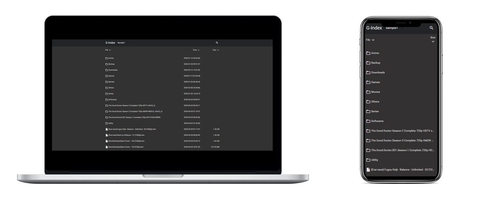

 

# Google Drive Index + Guide + Team Drive Maker [If you have G-suite Account]

## Full Guide to Deploy:

[GUIDE](https://telegra.ph/G-Index-DarkMode--MultiAuth--English--TD-Maker--Custom-Domainga-Tutorial-04-29)

## SAMPLE

https://g-d.rive.workers.dev/

## Search Implemented
- Features
  - <h3> ENGLISH LANGUAGE </h3>
  - Video Player - | mp4 | webm | avi | mpg | mpeg | mkv | rm | rmvb | mov | wmv | asf | ts | flv
  - Music Player - | mp3 | flac | wav | ogg | m4a
  - Document Viewer - | html | php | css | go | java | js | json | txt | sh | md | pdf
  - Image Viewer - | bmp | jpg | jpeg | png | gif
  - Multi drive encryption
  - Mobile Friendly
  - Multi-level Search within the team drive
  - Dark Theme
    - Main Color:
        - red | pink | purple | deep-purple | indigo | blue | light-blue | cyan | teal | green | light-green | lime yellow | amber orange | deep-orange | brown | greyblue-grey

     - Accent Color:
        - red | pink | purple | deep-purple | indigo | blue | light-blue | cyan | teal | green | light-green | lime | yellow | amber | orange | deep-orange

     - darkmode: true/false

# How to use?

## Deployment  

1.Install `rclone` software locally  
2.Follow [https://rclone.org/drive/]( https://rclone.org/drive/) bind a drive  
3.Execute the command`rclone config file` to find the file `rclone.conf` path  
4.Open `rclone.conf`,find the configuration `root_folder_id` and `refresh_token`  
5.Download index.js in https://github.com/LeeluPradhan/Search/ and fill in root and refresh_token  
6.Deploy the code to [Cloudflare Workers](https://www.cloudflare.com/)

### Want to host to your repository?
1. Simply fork this
or
2. Download this repo and upload files as per your choice
3. Use https://www.jsdelivr.com/?docs=gh to use your own `app.js` and change path accordingly in `index.js`
4. Copy your completed `index.js` to [Cloudflare Workers](https://www.cloudflare.com/)
4. Enjoy :)

### Credits
https://github.com/yanzai/goindex

## Protect links
If you want main links to be protected and share direct links without password then use code from [branch 2.0](https://github.com/LeeluPradhan/G-Index/tree/2.0)

# Team Drive Maker

## Get Required Data from
Note: `You must have permissions to create shared drive in your account. This doesn't work with GMAIL Accounts, Required Gsuite Business+ Accounts. To check Open Google Drive and try to create Shared Drive first.`

* Open [Google Cloud Console](https://console.developers.google.com/apis/credentials)
* After creating project or if you already have one.
* Enable Drive API from [Here](https://console.developers.google.com/apis/library/drive.googleapis.com?q=drive)
* Click create credentials.
* Select OAuth client ID.
* Select Web application.
* Give it a name. (anything for your own reference)
* In Authorized JavaScript origins add `https://developers.google.com`
* In Authorized redirect URIs add `https://developers.google.com/oauthplayground`
* Save and note down your Client ID and Secret
* Open [Developers Playground](https://developers.google.com/oauthplayground)
* On Right Top Side click on Setting Icon 
* Click on Use your own OAuth credentials.
* Enter OAuth Client ID: and OAuth Client secret:
* Now back to same page [Developers Playground](https://developers.google.com/oauthplayground) left side Step 1 i.e. Select & authorize APIs
* Find Drive API v3
* Select First Option i.e. https://www.googleapis.com/auth/drive (Required)
* Click on Authorize API. and give permissions using your google account.
* It will turn to Step 2 Exchange authorization code for tokens at the end of authentication.
* Click on Exchange authorization code for tokens, if it goes to step 3, click on Step 2 yourself.
* Select the option Auto-refresh the token before it expires.
* Copy the refresh token and paste in [maker.js](https://github.com/LeeluPradhan/G-Index/maker.js) along with your own Client ID and Secret, your own logo, icons etc as per your taste
* Copy the Code and paste it into https://workers.cloudflare.com Site.

### Credits:
https://github.com/ParveenBhadooOfficial/Create-Google-Shared-Drive

# CMKB

